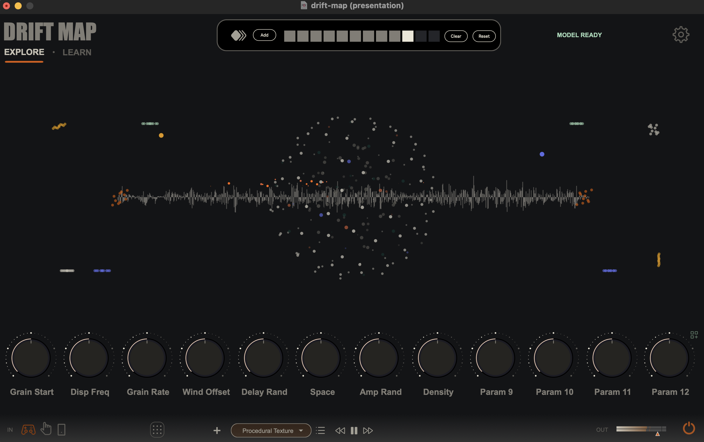

# Drift Map

Drift Map is an accessible digital musical instrument built in Max/MSP. It explores personalized gesture-to-sound mapping through interactive machine learning: performers choose gestures and sounds that suit their own abilities, create examples, and train a FluCoMa model that drives a Grainflow granular synthesizer in real time.

This repository accompanies the research project **Personalized Gesture-to-Sound Mapping for Accessible Digital Musical Instruments: An Interactive Machine Learning Approach**.

> **Status:** research prototype / pre-release. The source is available as an open-source Max project, and the first standalone release targets macOS on Apple Silicon (`arm64`).



## Signal flow

```text
Camera, gamepad, or OSC
                    ↓
        Gesture routing and calibration
                    ↓
     Personalized FluCoMa mapping model
                    ↓
        Grainflow granular synthesis, MIDI or OSC
```

The bundled tracker was compiled specifically to include MediaPipe and OpenCV locally. Camera vision therefore remains private and local: Drift Map does not record or transmit camera images. Only hand-landmark coordinates are sent from the tracker to Max over OSC on the same computer.

## Features

- Personalized gesture-to-sound mapping
- Guided and free interactive-learning workflows
- MediaPipe tracking for up to two hands
- Gamepad input
- MIDI and OSC connectivity
- Local gesture routing and calibration
- FluCoMa-based neural-network mapping
- Grainflow granular synthesis
- Included sounds and presets

## Prediction mode

In **Prediction** mode, the trained model listens to a four-dimensional position made from the left and right X/Y axes. The source of those four values depends on the selected input mode:

| Input mode | Left X | Left Y | Right X | Right Y |
| --- | --- | --- | --- | --- |
| Gamepad | Left stick X | Left stick Y | Right stick X | Right stick Y |
| Wearable | Left X axis | Left Y axis | Right X axis | Right Y axis |
| Hands / MediaPipe | Left middle-finger tip X | Left wrist Y | Right middle-finger tip X | Right wrist Y |

Direct input-to-parameter mapping is bypassed in this mode. The four input coordinates are sent to the trained model, and the model's predictions control the mapped sound parameters.

## Supported platform

The currently tested configuration is:

- macOS 11 or later
- Apple Silicon (`arm64`) for the MediaPipe tracker and first standalone pre-release
- Max 9.1.2 for the editable Max project

## Quick start

### macOS standalone

The standalone will be published as a macOS Apple Silicon pre-release on the [GitHub Releases page](https://github.com/mikaelmolliex/drift-map/releases).

Once a signed and notarized build is available:

1. Download and unzip the macOS release asset.
2. Move `DriftMap.app` to `/Applications`.
3. Open the application.
4. To use hand tracking, select **Hands** as the input mode and enable the camera control.
5. Approve camera access when macOS requests it. The request appears when the camera is first enabled, not when Drift Map opens.
6. Allow approximately 20–30 seconds for the first tracker launch. The launcher can retry automatically while macOS completes its first camera authorization.
7. To use a gamepad instead, connect a USB or Bluetooth controller and select **Gamepad** as the input mode.

### Saving presets in the standalone

Factory presets are read-only and cannot be overwritten. To modify one:

1. Load the factory preset you want to use as a starting point.
2. Choose **Save As** and save a new copy to a writable location on your local computer.
3. Continue editing the local copy.
4. Use **Save** to update that copy after it has been created.

Do not try to save changes directly over the factory preset inside the application bundle.

### Editable Max project

#### Requirements

- Max 9.1.2
- [FluCoMa for Max](https://github.com/flucoma/flucoma-max), including `fluid.mlpregressor~`
- [Grainflow](https://github.com/composingcap/grainflow) 2.1.2
- macOS 11 or later on Apple Silicon when using the included tracker

Install the complete FluCoMa and Grainflow packages through Max's Package Manager or from their official release sources before opening the project. The repository contains selected helper externals, but `fluid.mlpregressor~` is resolved from the installed FluCoMa package.

#### Max Project mode — recommended for development

MediaPipe controls are available only after the patch has been switched to Drift Map's **Development** mode. This project-specific mode is separate from Max's standard patcher editing state.

1. Clone or download the complete repository. Keep the entire `tracker/doublehand_mp/` directory intact.
2. Open `max/drift-map.0/drift-map.maxproj` in Max.
3. Exit Max's **Presentation Mode** to reveal the development controls.
4. Click the development bang button to switch Drift Map into **Development** mode.
5. Select tracker launch mode **2 — Max Project** if it is not already selected. This mode uses `run_mediapipe_maxmsp_project.js`.
6. Return to the interface and enable the camera control.

The project launcher resolves the tracker at:

```text
drift-map/
├── tracker/
│   └── doublehand_mp/
│       ├── doublehand_mp
│       └── _internal/
└── max/
    └── drift-map.0/
        ├── drift-map.maxproj
        ├── code/
        └── patchers/
```

Do not move `doublehand_mp` away from its `_internal/` directory.

#### Patch-only development mode

Tracker launch mode **0 — Development** uses `run_mediapipe_maxmsp.js`. In this mode, the launcher expects:

```text
max/drift-map.0/dist/doublehand_mp/doublehand_mp
```

Copy the complete `doublehand_mp/` directory to that location before opening `drift-map.maxpat` without its Max Project. The repository itself is organized for the recommended Max Project mode, so this extra copy is not needed when mode 2 is used.

#### Standalone build mode

Tracker launch mode **1 — Standalone** uses `run_mediapipe_standalone_camera_retry.js`. Before signing a compiled application, copy the complete tracker directory to:

```text
DriftMap.app/
└── Contents/
    └── Resources/
        └── tracker/
            └── doublehand_mp/
                ├── doublehand_mp
                └── _internal/
```

The tracker must be copied before the final application signature is created. Changing any executable or resource after signing invalidates that signature.

## MediaPipe and OSC

The packaged tracker is derived from the author's [GestureCap OSC](https://github.com/mikaelmolliex/gesturecap-osc) integration. It runs MediaPipe and OpenCV locally and sends hand landmarks to:

```text
127.0.0.1:11111
```

Primary OSC addresses:

```text
/hand/left
/hand/right
```

## OSC I/O overview

### Default configuration

| Section | Direction | Host / port |
| --- | --- | --- |
| Landmarks | IN | Local port `11111` |
| Wearable Left | IN | Local port `9001` |
| Wearable Right | IN | Local port `9002` |
| Dials | OUT | `127.0.0.1:9000` |

For incoming connections, the OSC sender must target the computer's local IP address and the corresponding local port. The Max patch does not need the sender's IP address.

### Wearable OSC input

No universal **Wearables IN** mapping has been defined yet. OSC devices and applications may use different addresses, value ranges, units, and sensor formats.

Users of the editable Max project must therefore:

- inspect the incoming OSC messages;
- route the relevant OSC addresses;
- adjust the scaling and calibration for their device;
- map the normalized values to the desired controls.

### Standalone compatibility

The current standalone does not support generic wearable OSC inputs because their routing and scaling cannot be adjusted by the user. Wearable input is therefore available only through the editable Max project, where programmers can configure the required OSC routing, ranges, scaling, and calibration.

It currently supports:

- MediaPipe hand-landmark input;
- USB or Bluetooth gamepad input;
- OSC Dials output.

Generic wearable OSC input may be added in a future version. This limitation is intentional: Drift Map does not impose a particular OSC application, wearable device, protocol structure, or sensor system. Programmers using the editable Max project remain free to implement the OSC workflow that best fits their setup.

## Troubleshooting

### `Tracker exists: false` or `ENOENT`

Confirm that the complete executable exists at the path expected by the selected launch mode. For the standalone, both the application name and installation location must match `/Applications/DriftMap.app` exactly.

### The tracker opens but no landmarks appear

- Confirm that macOS granted camera access.
- Confirm that Drift Map is receiving GestureCap OSC on port `11111`.
- Wait up to 30 seconds on the first launch.
- Check the Max console for tracker or OSC messages.

If camera access was denied, macOS records that decision and does not display the permission request again. Open **System Settings → Privacy & Security → Camera**, enable access for DriftMap, return to the application, and enable the camera again.

### `fluid.mlpregressor~` cannot be found

Install the complete FluCoMa package and restart Max. The editable project does not include a local copy of this external.

### Grainflow objects cannot be found

Install Grainflow 2.1.2 through Max's Package Manager or its official repository, then restart Max.

### Gatekeeper blocks the standalone

Use the signed and notarized GitHub Release asset. Do not replace its signature with an ad-hoc signature. Development exports are not intended for public distribution.

## Repository layout

```text
drift-map/
├── max/drift-map.0/              Max project, patch, scripts, presets, and media
├── tracker/doublehand_mp/        Packaged local MediaPipe tracker
├── docs/instrument-ui.png       Instrument interface preview
├── paper/                        Associated publication material
├── LICENSE                       Drift Map source-code license
└── THIRD_PARTY_NOTICES.md        Dependency and asset notices
```

## Audio and visual assets

The included factory audio examples were generated by the project author with Suno while subscribed to a paid plan and are provided as demonstration material for Drift Map.

SVG interface icons and logos are sourced from [Iconoir](https://iconoir.com/). See [THIRD_PARTY_NOTICES.md](THIRD_PARTY_NOTICES.md) for dependency and asset notices. A complete third-party license inventory must accompany the signed standalone release.

## Credits

Concept, design, and development: **Mikaël Molliex**.

AI-assisted tools supported brainstorming, JavaScript completion, debugging, and documentation. All design decisions and final integration were carried out by the author.

With occasional guidance from Dominic Thibault, Université de Montréal.

## License

Drift Map source code is distributed under the [GNU General Public License v3.0](LICENSE). Third-party components and assets remain subject to their respective licenses and notices.

## Contact

[contact@mikaelmolliex.com](mailto:contact@mikaelmolliex.com)

Suggestions, accessibility feedback, and bug reports are welcome.
